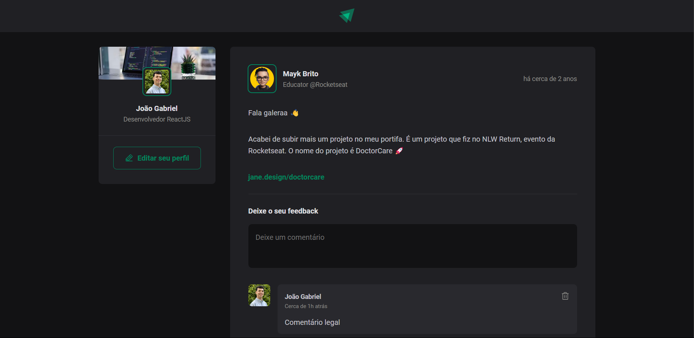

<h1 align="center"> ignite-feed </h1>

  <a href="#-tecnologias">Tecnologias</a>&nbsp;&nbsp;&nbsp;|&nbsp;&nbsp;&nbsp;
  <a href="#-projeto">Projeto</a>&nbsp;&nbsp;&nbsp;|&nbsp;&nbsp;&nbsp;
  <a href="#memo-licença">Licença</a>

  

 

  

## 🚀 Tecnologias

Esse projeto foi desenvolvido com as seguintes tecnologias:

- React
- TypeScript

## 🔥 Algumas features neste projeto

- React Hooks
- Tipagem com Typescript
- Componentização com React

## ✨ Neste projeto você pode ver

- Um exemplo de layout de rede social com posts e perfil do usuário.
- Campo de texto para escrever comentários totalmente funcional.
- Botão para "aplaudir" um post de um usário totalmente funcional.

## 💻 Projeto

- Esta é uma aplicação básica de rede social com comentários e likes funcionais criada com ReactJS

## ✅ Esse projeto foi criado ao longo do curso Ignite ReactJS da plataforma Rocketseat

## 📝 Licença

Esse projeto está sob a licença MIT.

---
